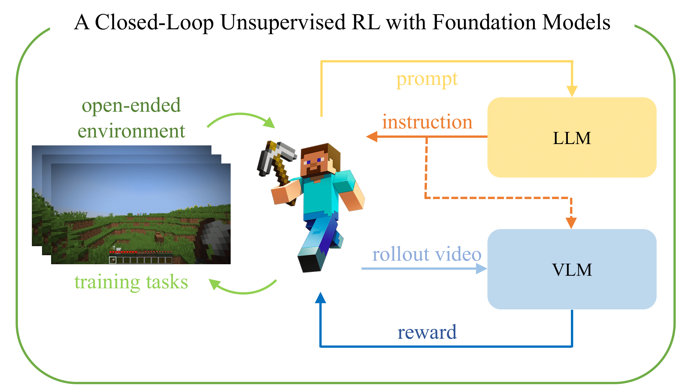
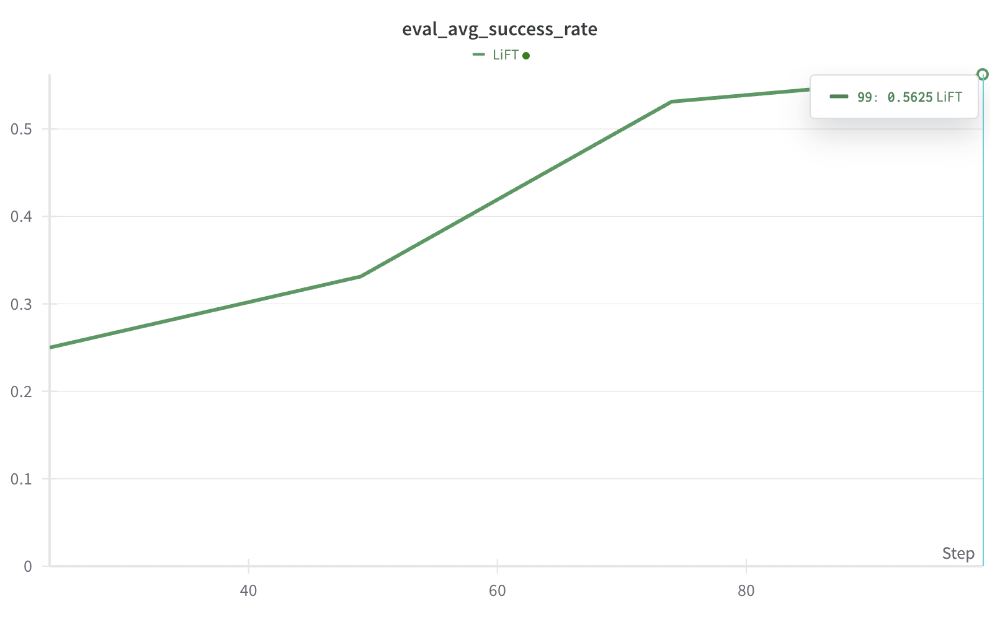

# Overview
<p align="center">

</img>
</p>

This is a repository for PyTorch implementation of paper "LiFT: Unsupervised Reinforcement Learning with Foundation Models as Teachers".

# How to run

```
conda create -n lift python=3.9
conda activate lift
```

## Libraries

```
mkdir lib
cd lib
```

#### PyTorch
```
pip install torch==1.13.0
```

#### MineDojo
```
sudo apt update -y 
sudo apt install -y software-properties-common
sudo add-apt-repository ppa:openjdk-r/ppa
sudo apt update -y
sudo apt install -y openjdk-8-jdk
sudo apt install xvfb xserver-xephyr python-opengl ffmpeg
sudo apt install vnc4server
```

```
git clone https://github.com/namsan96/MineDojo && cd MineDojo
pip install setuptools==65.5.0 "wheel<0.40.0" # gym issue
pip install -e .
```

```
# check openjdk-8 version
cd minedojo/sim/Malmo/Minecraft
./gradlew shadowJar
```

#### MineRL
```
pip install git+https://github.com/minerllabs/minerl # takes some times
# fix self._shape = () for line 205 in minerl/herobraine/hero/spaces.py file 
```

#### MineCLIP
```
git clone https://github.com/MineDojo/MineCLIP && cd MineCLIP
# !! comment out minedojo in requirements.txt
pip install -e .
```
```
# https://github.com/MineDojo/MineCLIP
# Download attn.pth in ./asset/mineclip/
```

#### VPT
```
git clone https://github.com/namsan96/Video-Pre-Training && cd Video-Pre-Training
pip install -e .
```

```
# https://github.com/openai/Video-Pre-Training
# Download bc-house-3x.weights in ./asset/vpt/
# Download foundation-model-3x.model in ./asset/vpt/
```

#### SiMPL
```
git clone https://github.com/namsan96/SiMPL && cd SiMPL
pip install -e .
```

#### torch_truncnorm
```
git clone https://github.com/namsan96/torch_truncnorm.git && cd torch_truncnorm
pip install -e .
```

#### others
```
pip install openai matplotlib wandb gym3 moviepy imageio pytube matplotlib pandas
```

## Training
```
# run cells in train.ipynb file
```

### Evaluation curve
<p align="center">

</img>
</p>

### Trained model
We provide a trained model with 100 epochs (above evaluation curve) at [this url](https://drive.google.com/file/d/1Ei9sU6gBXyC1qQohDGDlhOO58m-xcgy5/view?usp=sharing).

# Contributions
```
@inproceedings{
    nam2023lift,
    title={LiFT: Unsupervised Reinforcement Learning with Foundation Models as Teachers},
    author={Taewook Nam and Juyong Lee and Jesse Zhang and Sung Ju Hwang and Joseph J Lim and Karl Pertsch},
    year={2023},
    booktitle = {2nd Workshop on Agent Learning in Open-Endedness (ALOE) at NeurIPS 2023},
}
```
